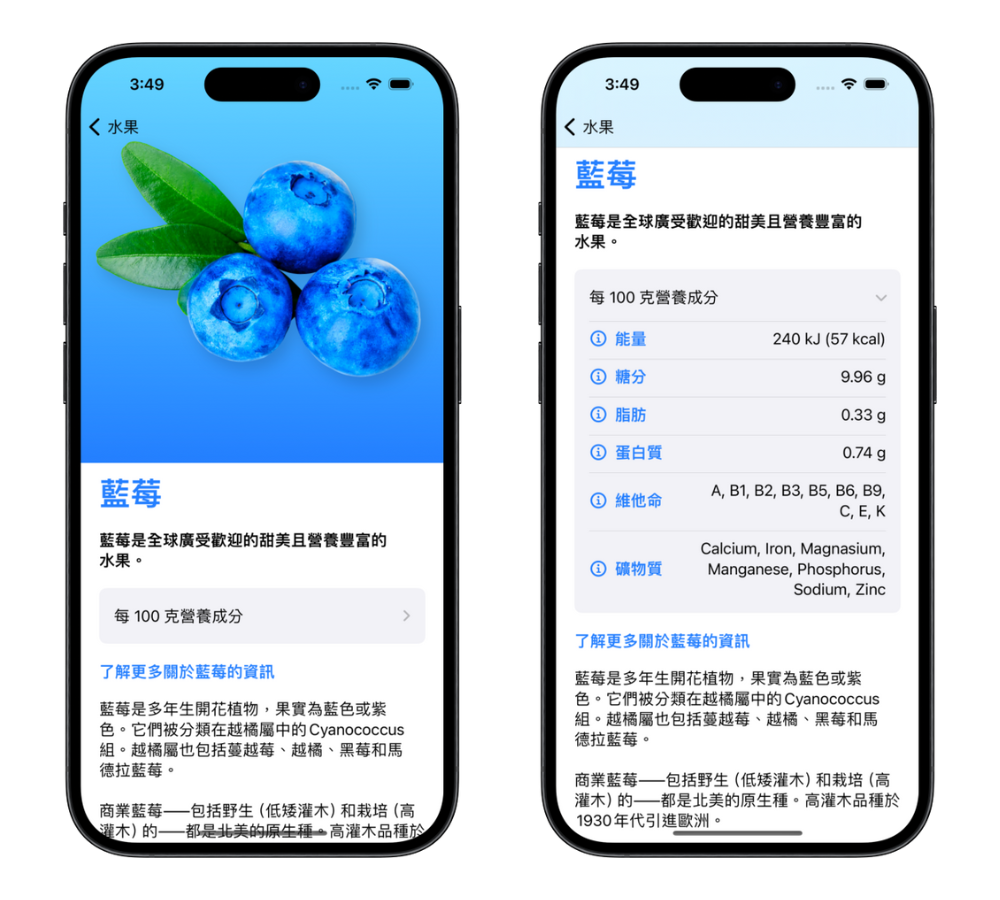

# 水果應用程式 🍎

此專案於 2024 年 5 月製作

「水果應用程式」是一個展示多種水果的 iOS App。使用者可以瀏覽水果列表，查看每種水果的詳細資訊，並在設定頁面進行相關設定。

## 專案展示 🖥

### App Demo

### 起始畫面

### 水果列表

### 水果資訊

### 設定頁面

## 使用技術 🔧

- **Swift**：負責邏輯撰寫

- **SwiftUI**：透過 `SwiftUI` 製作前端畫面，使用包括 `NavigationStack`、`NavigationLink`、`Toolbar`、`ScrollView`、`DisclosureGroup`、`Sheet`、`@State`、`@AppStorage` 等

## 功能 🚀

- **水果列表**：顯示所有水果

- **水果詳情**：點擊水果查看詳細資訊，包括名稱、營養成分、介紹等

- **設定頁面**：透過設定頁面返回主畫面

## 執行方式 🏃

1. `git clone` 此專案至本機

2. `cd` 進入專案資料夾

3. 使用 Xcode 開啟 `.xcodeproj` 檔案

4. 在 Xcode 中選擇模擬器或連接實體裝置，點擊執行啟動專案